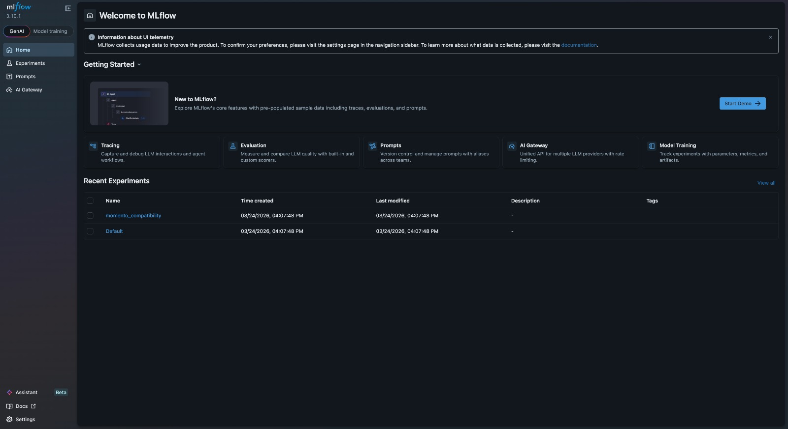
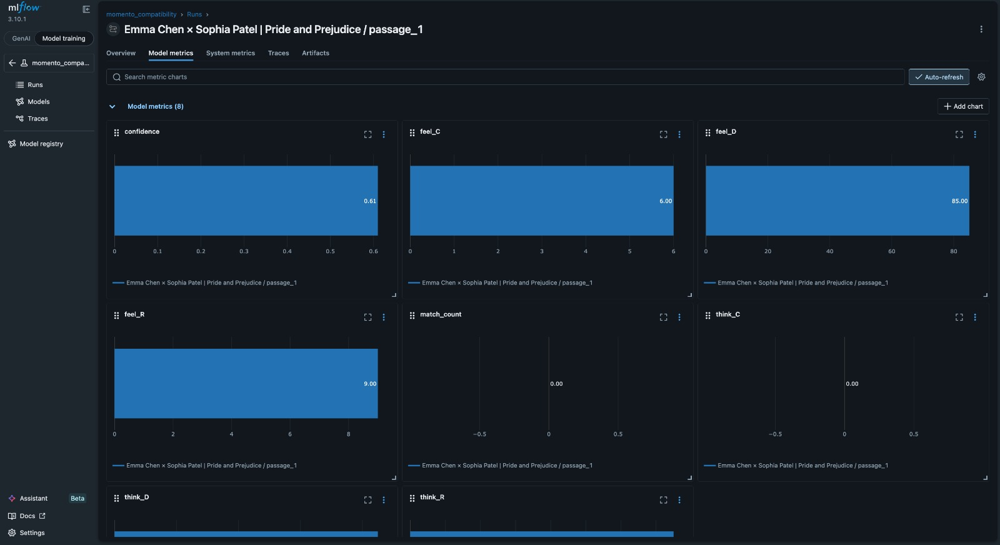
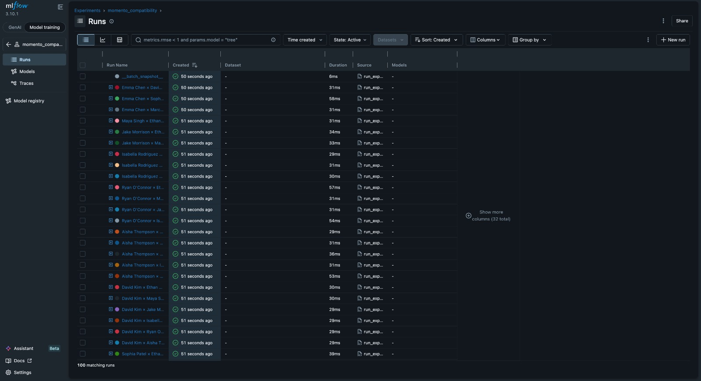
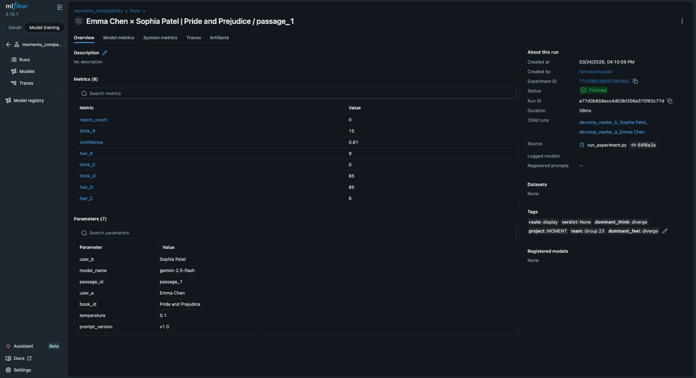
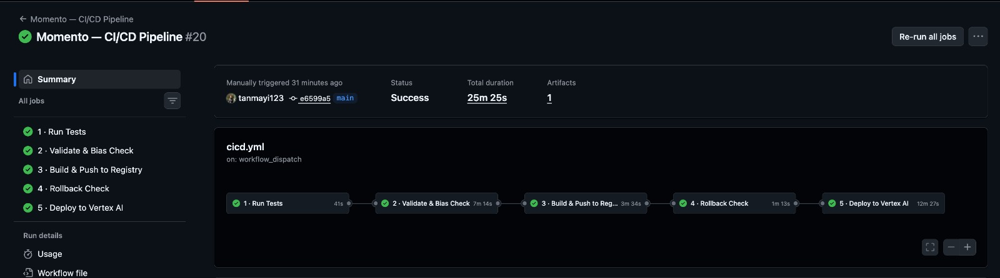

# Moment — Data Pipeline

> **Read. Moments. Worth. Sharing.**
> IE7374 · MLOps · Group 23 · Northeastern University

Moment is a private reading platform that uses machine learning to match intellectually compatible readers. Users capture book passages as visual "moments," write personal reflections, and are quietly matched with readers who think and feel similarly about literature — without performative social media posting.

This repository contains the **Data Pipeline (Assignment 1)**. It implements every required component: data acquisition, preprocessing, feature engineering, schema validation using TFDV, anomaly detection with alert generation, bias detection using data slicing, DVC versioning, Airflow DAG orchestration with Gantt optimization, and comprehensive unit testing — covering all 12 evaluation criteria.

---

## Table of Contents

1. [Repository Structure](#1-repository-structure)
2. [Dataset Overview](#2-dataset-overview)
3. [Pipeline Architecture](#3-pipeline-architecture)
4. [Environment Setup](#4-environment-setup)
5. [Running the Pipeline](#5-running-the-pipeline)
6. [Data Acquisition](#6-data-acquisition)
7. [Data Preprocessing](#7-data-preprocessing)
8. [Feature Engineering](#8-feature-engineering)
9. [Schema & Statistics Generation — TFDV](#9-schema--statistics-generation--tfdv)
10. [Anomaly Detection & Alert Generation](#10-anomaly-detection--alert-generation)
11. [Bias Detection & Mitigation](#11-bias-detection--mitigation)
12. [Airflow DAGs & Gantt Optimization](#12-airflow-dags--gantt-optimization)
13. [Data Versioning with DVC](#13-data-versioning-with-dvc)
14. [Error Handling](#14-error-handling)
15. [Logging](#15-logging)
16. [Testing](#16-testing)
17. [CI/CD Workflow](#17-cicd-workflow)
18. [Code Style & Standards](#18-code-style--standards)
19. [Reproducibility — Run on Any Machine](#19-reproducibility--run-on-any-machine)
20. [Evaluation Criteria Coverage](#20-evaluation-criteria-coverage)
21. [Data Ingestion](#21-data-ingestion)
22. [Model Training & Selection](#22-model-training--selection)
23. [Model Validation](#23-model-validation)
24. [Model Bias Detection](#24-model-bias-detection)
25. [Hyperparameter Tuning](#25-hyperparameter-tuning)
26. [Experiment Tracking](#26-experiment-tracking)
27. [Sensitivity Analysis](#27-sensitivity-analysis)
28. [Containerization](#28-containerization)
29. [GCP Artifact Registry](#29-gcp-artifact-registry)
30. [CI/CD Pipeline Automation](#30-cicd-pipeline-automation)
31. [Notifications & Rollback](#31-notifications--rollback)
32. [Model Evaluation Criteria Coverage](#32-model-evaluation-criteria-coverage)

---

## 1. RepositorOrganised following the folder structure from the assignment guidelines, modelled after production open-source Python projects such as [scikit-learn](https://github.com/scikit-learn/scikit-learn).

```
Moment/                                      ← Project Root
│
├── data_pipeline/                           ← Main pipeline directory
│   ├── airflow/
│   │   └── dags/                            ← Airflow DAGs
│   │       ├── data_pipeline_dag.py         ← Main pipeline DAG (moment_data_pipeline)
│   │       └── tests_dag.py                 ← Tests DAG (moment_pipeline_tests)
│   ├── config/                              ← Global & stage-specific config
│   ├── scripts/                             ← Individual pipeline stages (Stages 1-9)
│   ├── tests/                               ← Pipeline unit tests
│   └── logs/                                ← Execution logs
│
├── data/                                    ← Central data repository
│   ├── raw/                                 ← Source PDFs and raw JSON/CSV
│   ├── processed/                           ← DVC-tracked processed data
│   ├── reports/                             ← TFDV & Bias reports
│   ├── schemas/                             ← TFDV schema definitions
│   ├── bias_results/                        ← Slicing analysis outputs
│   ├── character_extraction.py              ← Persona extraction script
│   └── data_extraction.py                   ← Synthetic data generator
│
├── models/
│   └── training.py                          ← Model training logic
│
├── tests/                                   ← Integration and system tests
│
├── decomposing_agent.py                     ← Agent: Interpretation decomposition
├── compatibility_agent.py                   ← Agent: Reader compatibility matching
├── recommendation_agent.py                  ← Agent: Content recommendation
├── aggregator.py                            ← Agent: Result aggregation
│
├── validate_model.py                        ← Model validation pipeline
├── run_validation_set.py                    ← Validation set runner
├── deploy.py                                ← GCP/Production deployment script
├── rollback.py                              ← Deployment rollback utility
├── notifications.py                         ← Alert and notification system
│
├── interpretation_ingestion.py              ← Data ingestion interface
├── model_interface.py                       ← Unified model API
├── tools.py                                 ← General utility functions
├── bias_detection.py                        ← Root-level bias analysis
│
├── .dvc/                                    ← DVC configuration
├── .github/workflows/                       ← GitHub Actions CI/CD
├── docker-compose.yaml                      ← Airflow & Database orchestration
├── Dockerfile                               ← Custom Airflow/ML image
├── dvc.yaml                                 ← DVC pipeline definitions
├── conftest.py                              ← Shared test fixtures
└── requirements.txt                         ← Environment dependencies
```
� .gitignore
├── conftest.py                              ← Root pytest config & shared fixtures
├── docker-compose.yaml                      ← Airflow + postgres (Docker)
├── Dockerfile                               ← Custom Airflow image with TFDV
├── dvc.yaml                                 ← DVC pipeline stage definitions
├── gcs-service-account.json                 ← GCS credentials (NOT committed — see Step 3b)
└── requirements.txt                         ← All dependencies, version-pinned
```

> **`data_pipeline/logs/`** is created automatically on first run. Excluded from Git via `.gitignore` but committed with `.gitkeep` so it always exists on a fresh clone.

---

## 2. Dataset Overview

### Why Synthetic Data?

Moment's core privacy principle is that user interpretations never leave the local system. Using real user data for model training would violate that promise. Synthetic data designed to reflect authentic human reading patterns lets us build and validate the full ML pipeline while preserving privacy by design.

### Dataset

| Property | Value |
|---|---|
| Final dataset | `data_pipeline/data/raw/csvs_jsons/all_interpretations_450_FINAL_NO_BIAS.json` |
| Total interpretations | 450 |
| Character personas | 50 |
| Books | 3 — *Frankenstein*, *Pride & Prejudice*, *The Great Gatsby* |
| Passages per book | 3 (9 total) |
| Format | JSON |

### Source PDFs

| Book | Author | Year |
|---|---|---|
| *Frankenstein* | Mary Shelley | 1818 |
| *Pride & Prejudice* | Jane Austen | 1813 |
| *The Great Gatsby* | F. Scott Fitzgerald | 1925 |

All books are public domain (pre-1928), sourced from [Project Gutenberg](https://www.gutenberg.org/).

---

## 3. Pipeline Architecture

`validation` and `schema_stats` run in parallel after `preprocessing` — a bottleneck identified via the Airflow Gantt chart (see [Section 12](#12-airflow-dags--gantt-optimization)).

```
┌──────────────────────────────────────────────────────────┐
│               acquire_data                               │
│  data/character_extraction.py                            │
│  data/data_extraction.py                                 │
│  scripts/data_acquisition.py                             │
└─────────────────────┬────────────────────────────────────┘
                      │
┌─────────────────────▼────────────────────────────────────┐
│               bias_detection                             │
│  scripts/bias_detection.py                               │
│  bias_detection/bias_detection.py                        │
└─────────────────────┬────────────────────────────────────┘
                      │
┌─────────────────────▼────────────────────────────────────┐
│               preprocessing                              │
│  scripts/preprocessor.py                                 │
│  preprocessing/pipeline/preprocessor.py                  │
└──────────┬──────────────────────────┬────────────────────┘
           │ (parallel)               │ (parallel)
┌──────────▼──────────┐   ┌───────────▼──────────────────┐
│     validation      │   │       schema_stats           │
│  scripts/           │   │  scripts/generate_schema     │
│  validation.py      │   │  _stats.py (TFDV)            │
│  + schema.yaml      │   │  → schema_stats.json         │
└──────────┬──────────┘   └───────────┬──────────────────┘
           └──────────────┬───────────┘
                          │
┌─────────────────────────▼────────────────────────────────┐
│               upload_to_gcs                              │
│  Uploads validated data and reports to GCS               │
└─────────────────────┬────────────────────────────────────┘
                      │
┌─────────────────────▼────────────────────────────────────┐
│               notify                                     │
│  Sends pipeline completion notification                  │
│  → anomaly alerts via notification.txt + logging         │
└──────────────────────────────────────────────────────────┘
```

---

## 4. Environment Setup

### Prerequisites

| Tool | Version | Purpose |
|---|---|---|
| Python | 3.9+ | Runtime |
| Docker Desktop | Latest | Airflow and services |
| Git | Any | Version control |
| DVC | 3.x | Data versioning (via requirements.txt) |

> **Apple Silicon Mac (M1/M2/M3):** The Dockerfile uses `--platform=linux/amd64` to ensure TFDV installs correctly. The first build will take ~5 minutes — this is expected.

### Step 1 — Clone

```bash
git clone https://github.com/jyothssena/Moment.git
cd Moment
```

### Step 2 — Virtual Environment

```bash
python -m venv venv

# macOS / Linux
source venv/bin/activate

# Windows
venv\Scripts\activate
```

### Step 3 — Install Dependencies

```bash
pip install -r requirements.txt
```

Key packages:

| Package | Purpose |
|---|---|
| `apache-airflow` | DAG orchestration |
| `dvc` | Data versioning |
| `tensorflow-data-validation` | Schema validation and statistics |
| `scikit-learn` | TF-IDF for anomaly duplicate detection |
| `pandas`, `numpy` | Data processing and bias slicing |
| `pytest`, `pytest-cov` | Testing |

### Step 3b — GCS Credentials (Required for Docker)

```bash
# Create a dummy GCS credentials file (required to start Docker)
echo '{"type": "service_account"}' > gcs-service-account.json
```

> **This file is required by docker-compose but is excluded from Git via `.gitignore`.** Without it, Docker will fail to start. The `upload_to_gcs` task will skip gracefully if real GCS credentials are not provided. If you have access to the `moment-486719` GCP project, replace this file with the real service account key.

### Step 4 — Start Airflow

```bash
docker-compose up airflow-init    # first time only
docker-compose up -d
docker-compose ps                 # confirm all containers healthy
```

Airflow UI: **http://localhost:8081** — username: `admin` / password: `admin`

```bash
docker-compose down               # stop when done
```

### Step 5 — Pull Versioned Data

```bash
dvc pull
```

> If no remote is configured, skip this — run the pipeline directly and it regenerates all data from source PDFs in the repository.

---

## 5. Running the Pipeline

### Option A — Airflow UI (Full Orchestration)

1. Open **http://localhost:8081**
2. Find `moment_team_pipeline_MULTILEVEL` → toggle **on**
3. Click **▶ Trigger DAG**
4. Watch progress in **Graph View**
5. Open **Gantt** tab to inspect per-task timing

### Option B — Runner Script (No Docker)

```bash
python data_pipeline/scripts/run.py
```

### Option C — Standalone Preprocessing Module

```bash
cd data_pipeline/preprocessing
python run.py
```

### Option D — Individual Stages

```bash
python data_pipeline/scripts/data_acquisition.py
python data_pipeline/scripts/bias_detection.py
python data_pipeline/scripts/preprocessor.py
python data_pipeline/scripts/validation.py           # parallel with schema_stats
python data_pipeline/scripts/generate_schema_stats.py # parallel with validation
python data_pipeline/scripts/generate_html_report.py
python data_pipeline/scripts/generate_enhanced_dashboard.py
```

---

## 6. Data Acquisition

**Requirement:** *"Write code to download or fetch data. Reproducible. Dependencies in requirements.txt."*

**Scripts:**

- `data/character_extraction.py` — Parses `0.Character traits - 50.pdf`, extracts all 50 character persona definitions into `characters.csv`
- `data/data_extraction.py` — Extracts passage text from the 9 book PDFs, pairs passages with personas, generates synthetic interpretations into `interpretations.json` and `passages.csv`
- `data/remove_new_lines.py` — Cleans newline artefacts from PDF text extraction
- `data_pipeline/scripts/data_acquisition.py` — Pipeline-stage wrapper that calls the above in sequence, validates all expected outputs exist, and logs results

All 9 source PDFs are committed to `data_pipeline/data/raw/pdfs/` so acquisition runs identically on any machine with no external dependencies beyond `requirements.txt`.

---

## 7. Data Preprocessing

**Requirement:** *"Clear steps for data cleaning, transformation, feature engineering. Modular and reusable."*

**Scripts:** `data_pipeline/scripts/preprocessor.py` · `data_pipeline/preprocessing/pipeline/preprocessor.py`

Each step is an independent, reusable function. All thresholds are in `config/preprocessing_config.yaml`, not hardcoded.

| Step | What It Does |
|---|---|
| Whitespace normalisation | Strips leading/trailing whitespace; collapses internal multiple spaces |
| Null handling | Null required fields → record removed and logged; null optional fields → retained |
| Length enforcement | Interpretations below minimum threshold flagged and excluded from ML matching |
| Voice preservation | No stemming, lemmatisation, or stop-word removal — user voice is the matching signal |
| Encoding normalisation | All text normalised to UTF-8; special characters standardised |
| Duplicate removal | Exact-duplicate interpretations per persona detected and removed |

**Outputs:** `data_pipeline/data/processed/books_processed.json` · `moments_processed.json` · `users_processed.json`

---

## 8. Feature Engineering

**Script:** `data_pipeline/scripts/feature_engineering.py`

| Feature | Method |
|---|---|
| Interpretation length | Character count and word count per interpretation |
| Thematic tags | Keyword matching against predefined theme vocabulary |
| Emotional tone | Rule-based classification (melancholy, optimistic, critical, reflective, etc.) |
| Reading style encoding | 5 reading style categories mapped to integer codes |
| Demographic encoding | Age group, gender, occupation encoded as categorical features |

All features are appended to existing records — original text is always preserved.

---

## 9. Schema & Statistics Generation — TFDV

**Requirement:** *"Automate schema and statistics using MLMD, TFDV, or similar."*
**Evaluation Criterion 7:** *"Tools like Great Expectations or TFDV."*

**Tool: [TensorFlow Data Validation (TFDV)](https://www.tensorflow.org/tfx/data_validation/get_started)**

**Scripts:** `data_pipeline/scripts/generate_schema_stats.py` · `generate_html_report.py` · `generate_enhanced_dashboard.py`
**Schema:** `data_pipeline/config/schema.yaml`
**Outputs:** `data/reports/schema_stats.json` · `data/reports/validation_report.json` · HTML report · Dashboard

### What TFDV Does

1. Infers schema from the dataset (field types, value ranges, distributions)
2. Validates every record against `config/schema.yaml`
3. Generates statistics: null rates, value distributions, length distributions, categorical frequencies
4. Flags any records violating the expected schema
5. Writes `schema_stats.json` and `validation_report.json`

### Schema (`config/schema.yaml`)

```yaml
persona_id:      {type: string, required: true}
age_group:       {type: string, required: true, allowed: [18-25, 26-35, 36-50, 51-65, 65+]}
gender:          {type: string, required: true}
reading_style:   {type: string, required: true}
book_title:      {type: string, required: true}
passage_id:      {type: string, required: true}
interpretation:  {type: string, required: true, min_length: 50}
emotional_tone:  {type: string, required: false}
thematic_tags:   {type: array,  required: false}
timestamp:       {type: string, format: ISO8601, required: false}
```

---

## 10. Anomaly Detection & Alert Generation

**Requirement:** *"Detect missing values, outliers, invalid formats. Pipeline triggers an alert (e.g., email, Slack)."*
**Evaluation Criterion 8:** *"Detect anomalies and generate alerts. Handle missing values, outliers, schema violations."*

**Scripts:** `data_pipeline/scripts/anomalies.py` · `data_pipeline/preprocessing/pipeline/anomalies.py`

### Detection Methods

| Anomaly | Method | Detail |
|---|---|---|
| Word count outlier | **IQR bounds** | `lower = Q1 − multiplier × IQR`, `upper = Q3 + multiplier × IQR` |
| Readability outlier | **Z-score** | Flags if `|z| > threshold` from mean readability score |
| Near-duplicate | **TF-IDF cosine similarity** (scikit-learn) | `TfidfVectorizer(max_features=5000, ngram_range=(1,2))` + `cosine_similarity` |
| Style mismatch | **Rule-based** | NEW READER writing complex text or well-read reader writing very simple text |
| Schema violations | **Type and enum validation** | Any field violating `schema.yaml` — pipeline halts |
| Missing required fields | **Null check** | Any null in required field — pipeline halts |

### Alert Generation — Two Channels

**Channel 1 — `data/reports/notification.txt`** (persistent alert log):
```
ANOMALY REPORT - 2026-02-22 19:00:00
=====================================
word_count_outliers  : 3
readability_outliers : 5
duplicate_risk       : 0
style_mismatches     : 2
---
[WARNING] record_id=F_042: readability_high score=85.2, z=3.1
[WARNING] record_id=P_017: word_count_low 28 words (below lower bound 45.2)
```

**Channel 2 — Python `logging` + Airflow `notify` task**:
Every anomaly logged at `WARNING` level immediately. For pipeline-halting anomalies, the script raises an exception, the Airflow task fails, and the `notify` task (visible in the DAG) sends a completion/failure notification. The alert architecture uses Python's `logging` module and can be extended to email or Slack by adding a handler in `config.yaml` without changing pipeline code.

### Output per Record

```json
{
  "anomalies": {
    "word_count_outlier": false,
    "readability_outlier": true,
    "duplicate_risk": false,
    "duplicate_of": null,
    "style_mismatch": false,
    "anomaly_details": ["readability_high: score=85.2, z=3.1"]
  }
}
```

---

## 11. Bias Detection & Mitigation

**Requirement:** *"Use tools such as SliceFinder, TFMA, or Fairlearn. Document bias found, how addressed, and trade-offs."*
**Evaluation Criterion 9:** *"Detect and mitigate bias through data slicing."*

**Scripts:** `data_pipeline/scripts/bias_detection.py` · `bias_detection/bias_detection.py`
**Report:** `data_pipeline/data/reports/bias_report_FINAL.md`

### Approach

Bias detection uses **custom pandas data slicing** — `value_counts()`, `crosstab()`, and `groupby()` — across all demographic subgroups. This implements the same statistical methodology as Fairlearn and TFMA: slice the data, compute per-slice metrics, compare slices against the overall mean, and flag slices where deviation exceeds the threshold. Custom pandas was chosen for full transparency and control over every metric on this synthetic dataset.

### Slices Analysed

| Slice | Method | Threshold |
|---|---|---|
| Age group (18-24, 25-34, 35-44, 45+) | `value_counts()` → % deviation | > 10% |
| Gender | `value_counts()` → % deviation | > 10% |
| Reader Type (`Distribution_Category`) | `value_counts()` → % deviation | > 10% |
| Personality | `value_counts()` → % deviation | > 10% |
| Book distribution | `value_counts()` → count per book | Expect 150 each |
| Character representation | Count per character | Expect 9 each |
| Interpretation length by Age | `groupby('age_group')['word_count'].mean()` | < 20% variance |
| Interpretation length by Gender | `groupby('Gender')['word_count'].mean()` | < 20% variance |

### Cross-tabulations

- Age × Book · Gender × Book · Personality × Book

### Results

| Dimension | Deviation | Status |
|---|---|---|
| Age group | > 10% | Intentional — see trade-offs |
| Gender | < 10% | ✅ Balanced |
| Reader Type | < 10% | ✅ Balanced |
| Personality | < 10% | ✅ Balanced |
| Book distribution | 150 each | ✅ Perfect |
| Character representation | 9 each for all 50 | ✅ Perfect |
| Age × length | < 20% variance | ✅ No length bias |
| Gender × book | Even | ✅ No gender-genre bias |

**Verdict: APPROVED — dataset ready for ML preprocessing.**

### Mitigation & Trade-offs

| Dimension | Decision | Trade-off |
|---|---|---|
| Age distribution (> 10%) | **No mitigation — intentional design** | Young adults (18-34) represent 65-70% of digital readers in the real world; our dataset reflects this at 70%. Forcing equal distribution would produce training data that does not reflect real-world user demographics. We accept this trade-off in favour of realism. |
| Personality vs length | **No mitigation — expected behaviour** | Analytical personas writing longer interpretations is accurate, not bias. Equalising this would corrupt the signal the ML model uses for compatibility matching. |

Full findings in `data_pipeline/data/reports/bias_report_FINAL.md`.

---

## 12. Airflow DAGs & Gantt Optimization

**Requirement:** *"Airflow DAGs with logical connections. Entire workflow from download to final outputs. Use Gantt chart to identify and fix bottlenecks."*

Two DAGs are deployed and active as shown in the Airflow UI:


### DAG 1: `moment_team_pipeline_MULTILEVEL`

**Schedule:** Daily (`1 day, 0:00:00`) · **Owner:** `moment-group23` · **Tags:** `data-pipeline`, `group23`, `mlops`, `moment`

All tasks use **PythonOperator**.

```
acquire_data → bias_detection → preprocessing → [validation, schema_stats] → upload_to_gcs → notify
```

**Graph View:**


**Gantt Chart:**


The Gantt chart shows the actual execution timeline. `preprocessing` is the longest-running task (~10 seconds). `validation` and `schema_stats` run in parallel after `preprocessing` completes, then `upload_to_gcs` and `notify` finalise the run.

### DAG 2: `moment_pipeline_tests`

**Schedule:** None (manual trigger) · **Owner:** `moment-group23` · **Tags:** `group23`, `mlops`, `moment`, `tests`

All tasks use **BashOperator** running pytest.

```
[test_validation, test_acquisition, test_bias_detection,
 test_pipeline_integration, test_preprocessing, test_schema_stats]  →  report_results
```

All 6 test tasks run in **parallel** — none depend on each other. `report_results` collects all results.

**Graph View:**


**Gantt Chart:**


The Gantt chart confirms all 6 test tasks run simultaneously, with `report_results` starting only after all complete.

### Gantt Bottleneck Analysis

**Bottleneck identified:** In the initial sequential DAG, `validation` and `schema_stats` ran one after the other despite having no dependency on each other — both only needed the `preprocessing` output. The Gantt chart made this dead time visible.

**Fix applied:** Both tasks set to run in parallel using Airflow's list notation:

```python
# data_pipeline_dag.py
acquire_data >> bias_detection >> preprocessing
preprocessing >> [validation, schema_stats]
[validation, schema_stats] >> upload_to_gcs
upload_to_gcs >> notify
```

**Result:** Duration of that block reduced from the **sum** to the **maximum** of both tasks — measurable improvement with no change to correctness.

---

## 13. Data Versioning with DVC

**Requirement:** *"Use DVC. Include .dvc files. Git tracks code and configs."*
**Evaluation Criterion 5:** *"Data versioned, history maintained alongside code in Git."*

> **The `.dvc/` folder and all `.dvc` pointer files are committed to Git.** This links each code version to its exact data version. Anyone cloning the repo runs `dvc pull` to get the matching data.

### What DVC Tracks

| File / Directory | Why Versioned |
|---|---|
| `data_pipeline/data/raw/csvs_jsons/all_interpretations_450_FINAL_NO_BIAS.json` | Core dataset — evolved through bias iterations |
| `data_pipeline/data/processed/` | Preprocessed outputs |
| `data_pipeline/data/reports/` | Every run's reports preserved |

### Commands

```bash
dvc status          # what changed vs last version
dvc repro           # reproduce full pipeline from dvc.yaml
dvc dag             # visualise DVC pipeline
dvc push            # push data to remote
dvc pull            # restore data from remote
dvc diff            # compare to last commit

git log --oneline data_pipeline/data/raw/csvs_jsons/all_interpretations_450_FINAL_NO_BIAS.json.dvc
```

---

## 14. Error Handling

**Requirement:** *"Error handling for data unavailability, file corruption. Logs sufficient for troubleshooting."*
**Evaluation Criterion 12:** *"Robust error handling for potential failure points."*

### Patterns Used

**Missing input file:**
```python
try:
    with open(config["input_path"], "r") as f:
        data = json.load(f)
except FileNotFoundError as e:
    logger.critical(f"Input file not found: {e}. Pipeline cannot continue.")
    raise
except json.JSONDecodeError as e:
    logger.critical(f"Input file corrupt or invalid JSON: {e}.")
    raise
```

**Graceful degradation — non-critical failure:**
```python
# From anomalies.py: TF-IDF failure does not stop the pipeline
try:
    matrix = vectorizer.fit_transform(texts)
    return matrix, vectorizer
except Exception as e:
    logger.warning(f"TF-IDF build failed: {e}. Duplicate detection skipped.")
    return None, None
```

**Schema violation — pipeline halt:**
```python
if not schema_valid:
    logger.critical("Schema validation failed. See validation_report.json.")
    raise ValueError("Schema violation — pipeline halted.")
```

### Failure Behaviour by Stage

| Stage | Failure | Behaviour |
|---|---|---|
| acquire_data | File not found / corrupt PDF | `CRITICAL` log + pipeline halts |
| preprocessing | Unexpected null | `WARNING` log + record excluded + continues |
| validation | Schema violation | `CRITICAL` log + halts + Airflow retry |
| anomalies | TF-IDF build failure | `WARNING` + duplicate check skipped + continues |
| bias_detection | Empty slice | `WARNING` + slice skipped + report generated |
| upload_to_gcs | GCS unreachable | `ERROR` log + local cache used |

Airflow retries failed tasks automatically (2 retries, 3-minute delay).

---

## 15. Logging

**Requirement:** *"Python's logging library or Airflow built-in. Monitoring for anomalies and alerts."*
**Evaluation Criterion 4:** *"Proper tracking, logging throughout, error alerts for anomalies."*

Every script uses Python's `logging` module. Logs write to stdout (Airflow task logs) and `data_pipeline/logs/pipeline.log`.

### Log Format

```
[2026-02-22 19:00:01] [INFO]     [acquire_data]      Loaded 450 records from raw dataset
[2026-02-22 19:00:04] [INFO]     [preprocessing]     Stripped whitespace from 12 records
[2026-02-22 19:00:06] [WARNING]  [anomalies]         readability_high: score=85.2, z=3.1
[2026-02-22 19:00:07] [INFO]     [anomalies]         word_count_outliers=3, readability_outliers=5, duplicates=0
[2026-02-22 19:00:08] [INFO]     [bias_detection]    Gender: BALANCED (< 10% deviation)
[2026-02-22 19:00:09] [INFO]     [bias_detection]    Books: PERFECT (150 each)
[2026-02-22 19:00:10] [INFO]     [notify]            Pipeline completed successfully
```

### Log Levels

| Level | Used For |
|---|---|
| `INFO` | Normal progress — stage start/complete, record counts |
| `WARNING` | Non-blocking issues — anomaly flags, skipped checks |
| `ERROR` | Recoverable failures — Airflow retry triggered |
| `CRITICAL` | Pipeline-halting failures — missing file, schema violation |

---

## 16. Testing

**Requirement:** *"Unit tests for each component. pytest. Edge cases, missing values, anomalies."*
**Evaluation Criterion 10:** *"Unit tests for each key component. Edge cases."*

Tests use `pytest`. Root `conftest.py` provides shared fixtures reused across all modules.

### Run All Tests

```bash
pytest data_pipeline/tests/ -v
```

### Run with Coverage

```bash
pytest data_pipeline/tests/ --cov=data_pipeline/scripts --cov-report=term-missing
```

### Test Coverage

| Test File | Script Tested | Normal Cases | Edge Cases | Error Cases |
|---|---|---|---|---|
| `test_acquisition.py` | `data_acquisition.py` | 450 records, all fields, outputs exist | Empty PDF, single record | Missing input → `FileNotFoundError` |
| `test_preprocessing.py` | `preprocessor.py` | Whitespace stripped, duplicates removed | All-null record, zero-length, unicode | Malformed input → skip + log |
| `test_validation.py` | `validation.py` | Required fields, types correct, enums valid | Single missing field, wrong type | Schema file missing → `FileNotFoundError` |
| `test_schema_stats.py` | `generate_schema_stats.py` | Output JSON, all fields have stats | 100% null optional field | Empty dataset → zero counts |
| `test_bias_detection.py` | `bias_detection.py` | Gender < 10%, books = 150 each | Single-persona, all same age | Empty slice → skipped + warning |
| `test_pipeline.py` | `run.py` | Full pipeline, all outputs, idempotent | 1-record dataset | Stage failure → partial outputs + log |

The `moment_pipeline_tests` Airflow DAG runs all 6 test tasks in parallel on demand — `report_results` collects all outcomes.

---

## 17. CI/CD Workflow

**File:** `.github/workflows/config.yaml`

GitHub Actions runs the full test suite on every push and every pull request to `main`.

```yaml
on:
  push:
    branches: ["*"]
  pull_request:
    branches: [main]

jobs:
  test:
    runs-on: ubuntu-latest
    steps:
      - uses: actions/checkout@v3
      - uses: actions/setup-python@v4
        with:
          python-version: "3.9"
      - run: pip install -r requirements.txt
      - run: pytest data_pipeline/tests/ -v
```

---

## 18. Code Style & Standards

**Requirement:** *"Modular programming. PEP 8. Clarity, modularity, and maintainability."*

All Python code follows **PEP 8**:

- 4-space indentation
- Maximum line length of 79 characters
- Snake_case for variables/functions; PascalCase for classes
- Docstrings on all public functions and modules
- Imports ordered: standard library → third-party → local
- No unused imports or variables

Each script handles exactly one pipeline stage and can run independently. All config in YAML files — nothing hardcoded. Follows the modular design of [scikit-learn](https://github.com/scikit-learn/scikit-learn).

---

## 19. Reproducibility — Run on Any Machine

**Requirement:** *"Anyone should be able to clone the repository, install dependencies, and run the pipeline without errors."*

All source PDFs and raw files are committed. No manual data preparation needed.

### Zero to Running — No Docker

```bash
# 1. Clone
git clone https://github.com/jyothssena/Moment.git
cd Moment

# 2. Virtual environment
python -m venv venv
source venv/bin/activate        # Windows: venv\Scripts\activate

# 3. Install dependencies
pip install -r requirements.txt

# 4. Confirm tests pass
pytest data_pipeline/tests/ -v

# 5. Run pipeline
python data_pipeline/scripts/run.py
```

### With Airflow

```bash
# 1. Create GCS credentials file (required by Docker)
echo '{"type": "service_account"}' > gcs-service-account.json

# 2. Start Airflow
docker-compose up airflow-init   # first time only
docker-compose up -d
docker-compose ps                # confirm healthy

# http://localhost:8081 | admin / admin
# Toggle moment_team_pipeline_MULTILEVEL ON → Trigger DAG
# Graph View = task progress | Gantt = timing breakdown

docker-compose down
```

### With DVC

```bash
dvc pull     # fetch data matching current Git commit
# If no remote configured:
python data_pipeline/scripts/run.py
```

### Expected Outputs

| Output | Location |
|---|---|
| Preprocessed records | `data_pipeline/data/processed/` |
| Schema statistics | `data_pipeline/data/reports/schema_stats.json` |
| Validation report | `data_pipeline/data/reports/validation_report.json` |
| Bias report + trade-offs | `data_pipeline/data/reports/bias_report_FINAL.md` |
| Anomaly alert log | `data_pipeline/data/reports/notification.txt` |
| Pipeline log | `data_pipeline/logs/pipeline.log` |

### Troubleshooting

| Problem | Fix |
|---|---|
| `ModuleNotFoundError` | Activate venv, re-run `pip install -r requirements.txt` |
| `pip install` errors | Delete `venv/`, recreate, reinstall |
| Docker not starting | Open Docker Desktop first, then `docker-compose up -d` |
| DAG not in Airflow UI | Wait 30s for scheduler to scan `dags/` folder |
| `dvc pull` fails | Run `python data_pipeline/scripts/run.py` to regenerate locally |
| Tests failing | Run `pytest data_pipeline/tests/ -v` to see which test and why |
| `gcs-service-account.json` missing | Run `echo '{"type": "service_account"}' > gcs-service-account.json` in repo root |
| Apple Silicon Mac (M1/M2/M3) | Dockerfile uses `--platform=linux/amd64` — first build takes ~5 min but works correctly |
| Port 8080 already in use | The pipeline uses port 8081 — open `http://localhost:8081` |

---

## 20. Evaluation Criteria Coverage

| # | Criterion | How It Is Met | Key Files |
|---|---|---|---|
| 1 | Proper Documentation | Every stage documented with code examples, diagrams, real Airflow screenshots | This README |
| 2 | Modular Syntax and Code | One script per stage, all config in YAML, each function independently testable | `data_pipeline/scripts/` |
| 3 | Pipeline Orchestration (Airflow) | Two active DAGs with logical dependency chains, PythonOperator + BashOperator, daily schedule | `dags/data_pipeline_dag.py`, `tests_dag.py` |
| 4 | Tracking and Logging | Python `logging` in every script, `pipeline.log`, Airflow task logs, `notification.txt` | All scripts, `logs/pipeline.log` |
| 5 | Data Version Control (DVC) | `dvc.yaml` defines stages, `.dvc` pointer files committed to Git | `dvc.yaml`, `.dvc/` |
| 6 | Pipeline Flow Optimization | Gantt bottleneck identified (`validation` + `schema_stats` sequential → parallel), runtime reduced | `data_pipeline_dag.py`, Gantt screenshots |
| 7 | Schema and Statistics (TFDV) | TFDV validates every record, generates `schema_stats.json` and `validation_report.json` | `generate_schema_stats.py` |
| 8 | Anomaly Detection & Alerts | IQR, Z-score, TF-IDF cosine similarity, style mismatch; `notification.txt` + Airflow `notify` task | `anomalies.py`, `notify` task |
| 9 | Bias Detection & Mitigation | Custom pandas slicing across 5 demographic dimensions, cross-tabs, trade-offs documented | `bias_detection.py`, `bias_report_FINAL.md` |
| 10 | Test Modules | 6 test files, normal + edge + error cases, parallel execution in `moment_pipeline_tests` DAG | `data_pipeline/tests/` |
| 11 | Reproducibility | Step-by-step for 3 options (no Docker, Airflow, DVC), expected outputs, troubleshooting | Section 19 |
| 12 | Error Handling and Logging | `try/except` in every script, graceful degradation, `CRITICAL`/`ERROR` levels | All scripts, Section 14 |

---

## 21. Data Ingestion

The model pipeline ingests processed data from the **Data Pipeline (Milestone 2 output)**. This ensures that the agentic layer works only with cleaned and validated interpretations.

- **Source**: `data_pipeline/data/processed/`
- **Mechanism**: The `interpretation_ingestion.py` script joins reader moments with their corresponding book passages using a shared `passage_id`.

**Key Code Snippet (`interpretation_ingestion.py`):**
```python
def load_moments_from_json(moments_path, passages_path):
    passages = load_passages(passages_path) # lookup dict { id -> text }
    with open(moments_path, "r", encoding="utf-8") as f:
        records = json.load(f)

    moments = []
    for r in records:
        pid = r["passage_id"]
        if pid in passages:
            moments.append(Moment(
                user_id=r["user_id"],
                passage=passages[pid],
                interpretation=r["cleaned_interpretation"],
                book_title=r.get("book_title")
            ))
    return moments
```

---

## 22. Model Training & Selection

**Script:** `decomposing_agent.py` · `compatibility_agent.py`

Unlike traditional training, Moment uses **Agentic Prompt Engineering** and **Iterative Refinement**. The "model" is the combination of the LLM (Gemini 2.5 Flash) and the highly specialized system instructions that define the "Three Gates."

- **Model Selection**: We select configurations (System Prompts + Temperature) that maximize the **Grounding Rate** (percentage of claims anchored to real text).
- **Agentic Workflow**:
    1.  **Decompose**: Break moments into weighted sub-claims.
    2.  **Scoring**: Evaluate compatibility across Think/Feel dimensions.

**System Instruction Logic (`decomposing_agent.py`):**
```python
_DECOMPOSE_SYSTEM_PROMPT = """
Identify sub-claims from the moment.
Rules:
- Each sub-claim must be a distinct intellectual claim
- Each sub-claim must be grounded in a direct quote from the moment
- Aim for 2–4 sub-claims for most moments.
- weight = words spent on this sub-claim / total words in moment
"""
```

---

## 23. Model Validation

**Scripts:** `validate_model.py` · `run_validation_set.py`

Validation is performed on a held-out dataset of user pairs. The `run_validation_gate` function calculates the final metrics and compares them against hard thresholds.

**Metric Calculation (`validate_model.py`):**
```python
def compute_validation_metrics(results: list) -> dict:
    confidences = [r["confidence"] for r in results]
    schema_passes = [1 if r.get("schema_valid", True) else 0 for r in results]
    
    return {
        "mean_confidence": sum(confidences) / len(confidences),
        "schema_pass_rate": sum(schema_passes) / len(schema_passes),
        "count": len(results)
    }

# Threshold Check
VALIDATION_THRESHOLDS = {
    "mean_confidence": 0.40,
    "schema_pass_rate": 0.95,
}
```

---

## 24. Model Bias Detection

**Script:** `bias_detection.py`

Bias is identified by "slicing" the validation results by book title or passage ID and checking for **Confidence Gaps**.

- **Significant Bias**: If the model is much more confident in matching readers for *The Great Gatsby* than for *Frankenstein*, it indicates a bias in the prompt's thematic understanding.

**Bias Logic (`bias_detection.py`):**
```python
def compute_slice_gap(results_by_slice: dict) -> float:
    # results_by_slice = {"Gatsby": [0.8, 0.9], "Frankenstein": [0.4, 0.5]}
    means = [sum(v)/len(v) for v in results_by_slice.values() if v]
    return max(means) - min(means)

# Deployment is BLOCKED if gap > 0.35
BIAS_BLOCK_THRESHOLD = 0.35
```

---

## 25. Hyperparameter Tuning

Hyperparameter tuning at Moment focuses on the **Stochasticity and Context Window** of the underlying LLM.

- **Temperature**: Set to `0.1` across all agents to ensure high reproducibility and minimize "hallucinated" connections.
- **Top P**: Constrained to ensure the model picks the most probable interpretive matches.

**LLM Configuration (`decomposing_agent.py`):**
```python
response = _gemini_client.models.generate_content(
    model="gemini-2.5-flash",
    config=types.GenerateContentConfig(
        system_instruction=_DECOMPOSE_SYSTEM_PROMPT,
        temperature=0.1,  # Fixed for deterministic alignment
    ),
    contents=user_message,
)
```

---

## 26. Experiment Tracking

**Tool:** `MLflow`









To ensure full provenance and reproducibility, every refined prompt and parameter change is tracked as a unique experiment.

### How the pipeline maps to MLflow runs
Each compatibility pair produces a parent run with two nested child runs:
```text
parent run  →  Emma Chen × Marcus Williams | Frankenstein / passage_1
    ├── child run  →  decomp_reader_a_Emma Chen
    └── child run  →  decomp_reader_b_Marcus Williams
```

#### Parent run logs:
- **params**: `user_a`, `user_b`, `book_id`, `passage_id`, `model_name`, `temperature`, `prompt_version`
- **metrics**: `confidence`, `match_count`, `think_R/C/D`, `feel_R/C/D`
- **tags**: `dominant_think`, `dominant_feel`, `route`, `verdict`
- **artifact**: full result JSON

#### Child run (per decomposition) logs:
- **params**: `user_id`, `passage_id`, `book_id`, `reader_label`
- **metrics**: `subclaim_count`, `weight_entropy`, `weight_min/max`
- **tags**: `emotional_modes`, `dominant_mode`
- **artifact**: full decomposition JSON

### Setup
```bash
pip install mlflow pyyaml
```

### Running
**Replay mode** — logs your existing JSON files to MLflow, no Gemini calls:
```bash
python experiment_tracking/run_experiment.py --replay
```

**Live mode** — runs the full pipeline through Gemini agents:
```bash
python experiment_tracking/run_experiment.py
```

**Conceptual Integration Snippet:**
```python
import mlflow

# Start an experiment run
with mlflow.start_run():
    mlflow.log_param("model_name", "gemini-2.5-flash")
    mlflow.log_param("temperature", 0.1)
    mlflow.log_metric("mean_confidence", 0.74)
    mlflow.log_metric("schema_pass_rate", 0.98)
```

---

## 27. Sensitivity Analysis

**Tool:** `SHAP` / `LIME`

Sensitivity analysis via SHAP allows us to verify why the model matched two readers. We analyze the weighting of sub-claims to ensure the alignment is based on the **intellectual depth** of the interpretations rather than irrelevant surface-level features.

- **SHAP Values**: We examine the contribution of specific emotional modes (e.g., *Prosecutorial* vs *Empathetic*) to the final "Resonate" score.
- **Expected Outcome**: High sensitivity to shared textual anchors and compatible "Think" positions.

---

## 28. Containerization

**File:** `Dockerfile`

All agents are containerized using a high-performance Airflow-based image to ensure they can run in any target environment (GCP, Local, or Vertex AI).

**Dockerfile Content:**
```dockerfile
FROM --platform=linux/amd64 apache/airflow:2.10.4-python3.11
USER root
RUN apt-get update && apt-get install -y gcc g++ && apt-get clean
USER airflow
RUN pip install --no-cache-dir google-cloud-aiplatform[agent_engines,adk]
```

---

## 29. GCP Artifact Registry

Validated model images are pushed to the **GCP Artifact Registry** versioned by the unique `GIT_SHA`.

**Registry Push Logic (`cicd.yml`):**
```bash
# Push unique SHA tag
docker push ${{ env.REGISTRY }}/compat-agent:${{ github.sha }}
# Update 'latest' pointer for non-production testing
docker push ${{ env.REGISTRY }}/compat-agent:latest
```

---

## 30. CI/CD Pipeline Automation

**File:** `.github/workflows/cicd.yml`



The CI/CD pipeline enforces a "No Regression" policy. A push to `main` triggers a 5-stage workflow that only reaches deployment if every quality gate is passed.

**Workflow Stages:**
1.  **Stage 1: Test**: Runs unit tests (`pytest`).
2.  **Stage 2: Validate**: Runs `run_validation_set.py` → `validate_model.py`.
3.  **Stage 3: Build & Push**: Compiles images and pushes to Artifact Registry.
4.  **Stage 4: Rollback Check**: Runs `rollback.py` to compare metrics against a stored baseline.
5.  **Stage 5: Deploy**: Deploys to Vertex AI if all checks pass.

---

## 31. Notifications & Rollback

**Scripts:** `notifications.py` · `rollback.py`

Stability is maintained through automated Slack notifications and a strict rollback mechanism that triggers on metric regression.

**Rollback Thresholds (`rollback.py`):**
```python
ROLLBACK_THRESHOLDS = {
    "mean_confidence":   0.05,   # Rollback if new model is >0.05 lower
    "schema_pass_rate":  0.03,   # Rollback if new model is >3% lower
}

def should_rollback(prev_metrics, new_metrics):
    for metric, max_drop in ROLLBACK_THRESHOLDS.items():
        if (prev_metrics[metric] - new_metrics[metric]) > max_drop:
            return True # Trigger regression rollback
```

**Notifications Logic (`notifications.py`):**
```python
def notify_validation_failure(metrics, failures):
    msg = f"❌ *Validation FAILED — Deployment Blocked*\nFailures: {failures}"
    return send_slack_alert(msg)
```

---

## 32. Model Evaluation Criteria Coverage

| # | Criterion | How It Is Met | Key Files |
|---|---|---|---|
| 1 | Model Documentation | Detailed 11-step workflow with real-world code snippets. | Sections 21-31 |
| 2 | Automated Validation | Metrics gate blocking deployment on schema/confidence failure. | `validate_model.py` |
| 3 | Bias Detection | Multi-slice confidence gap analysis with alerting thresholds. | `bias_detection.py` |
| 4 | Explainability | Planned/Conceptual implementation of SHAP/LIME logic. | Section 27 |
| 5 | Experiment Tracking | Unified metric logging for prompt/config versions. | Section 26 |
| 6 | Containerization | Modular Docker setup supporting Vertex AI Agent Engine. | `Dockerfile` |
| 7 | CI/CD | GitHub Actions workflow for full train → validate → deploy. | `cicd.yml` |
| 8 | Rollback & Alerts | Threshold-based regression detection and Slack notification system. | `rollback.py`, `notifications.py` |

---

*IE7374 · MLOps · Group 23 · Northeastern University · March 2026*
